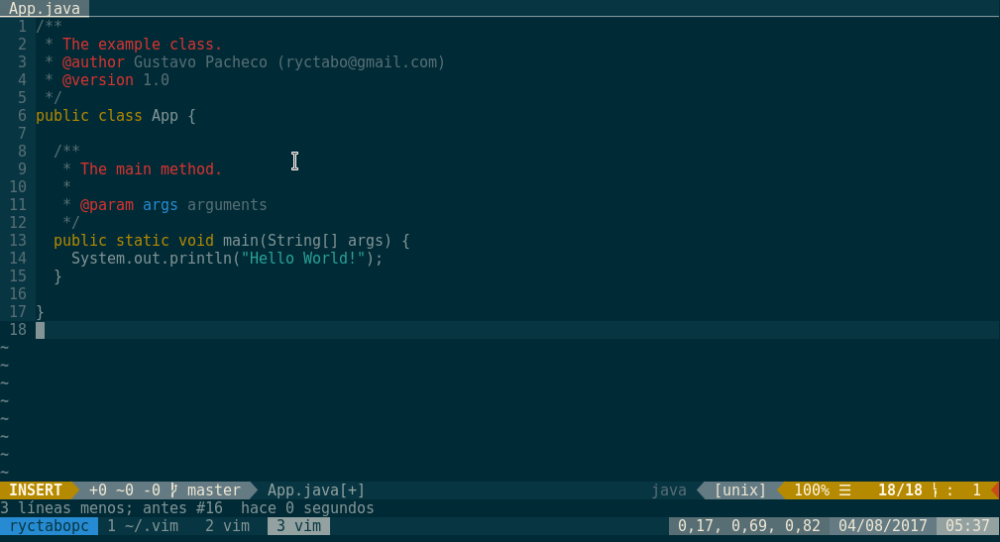
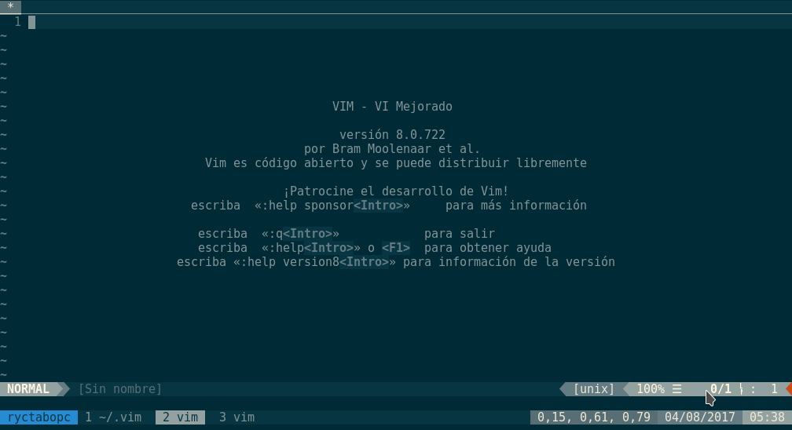

# Ryctabo VimRC



This my vimrc setup. Keeping your vim setup in a Git repository is cool because you can track the changes you do to your set up, you can rollback if something goes wrong, you can branch and test new settings while keeping your base setup stable.

## Requirements
- An UNIX box running Linux.
- Vim 8.0, Although it can work with previous versions.
- git is required for vundle-vim.

## Install
To install you must follow the following setps:

1. Clone this repository in `.vim` folder, to do this step you must have saved a backup of the `.vim` folder.

    ```sh
    $ git clone git@github.com:ryctabo/vimrc.git ~/.vim
    ```
2. Create a symbolic link to `vimrc` file, remember to also have a `.vimrc` file backup.

    ```sh
    $ ln -s ~/.vim/vimrc ~/.vimrc
    ```
3. Install [Solarized]() theme:

    ```sh
    $ git clone git@github.com:altercation/vim-colors-solarized.git ~/.vim/themes/solarized
    $ cp ~/.vim/themes/solarized/colors/* ~/.vim/colors
    ```

4. Install [Vundle](https://github.com/VundleVim/Vundle.vim).

    ```sh
    $ git clone https://github.com/VundleVim/Vundle.vim.git ~/.vim/bundle/Vundle.vim
    ```
5. Install plugins:

    Launch `vim` and run `:PluginInstall`

    To install from to command line: `vim +PluginInstall +qall`

Done, you already have my vim settings installed.
